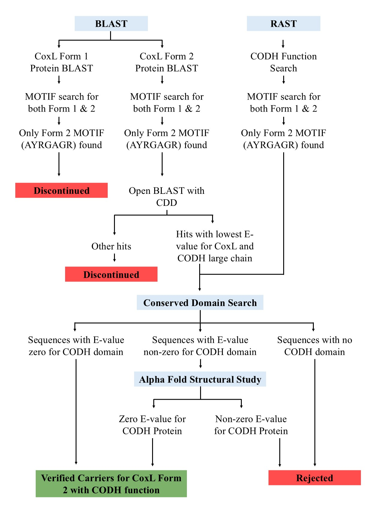

# Rice Phyllosphere and Trace Gases Metabolisers

## Description
Investigating the relative abundance of carbon monoxide-metabolizing prokaryotes in the rice phyllosphere of *indica* and *japonica* sub-species, and their correlation with the concentrations of lignin precursors and secondary metabolites synthesised by rice crops.

## Input Files
The input files are from one of my supervisors previous work. The articles where you get the file are listed below.
1) Metagenomic Assembled Genomes accession number excel file: ["Recovery of metagenome-assembled genomes from the phyllosphere of 110 rice genotypes"](https://doi.org/10.1038/s41597-022-01320-7) and go to the supplementary data 2.
2) Rice Cultivars accession and the Metagenomes accession excel file: ["Microbiome homeostasis on rice leaves is regulated by a precursor molecule of lignin biosynthesis"](https://doi.org/10.1038/s41467-023-44335-3) and go to the Supplimentary Data 1.
3) Lignin Precursor concentration excel file: (Article not published yet, once available the link will be attached here)

## Process Flowchart
The process how the coxL gene carrying geneomes are identified is explained in the below flow chart.

## Folder Architecture
Inside each folder, there is a .txt file named after the folder itself. For example, the BLAST folder contains a file called blast.txt. This text file explains the folder's structure by describing the subfolders and files it contains. The format of this file is explained below.

### Basics
-file : referes it is a file

-folder : referes it is a folder

### Structure
(main-folder) Parent Folder Name (ex: BLAST)

|-folder Folder 1: description (this is inside main-folder)

||--folder Sub-folder 1: description (this is inside Folder 1)

||--folder Sub-folder 2: description (this is inside Folder 1)

|||---folder Folder inside Sub-folder: description (this is inside Sub-Folder 2)

||--folder Sub-folder 3: (this is inside Folder 1)

|||---folder Folder inside Sub-folder: description (this is inside sub-folder 3)

|||---file filename.extension (ex: mag.csv): description (this is inside sub-folder 3)

| <- (A break between two folders structure)

|-folder Folder 2: description (this is inside main-folder)

||--file filename.extension: description (this is inside Folder 2)

## Short Description on Computer Languages Used
The analysis is mostly done using Python in Jupyter Notebook except redundancy analysis which uses R language. The redundancy analysis files are in the folder RDA.
